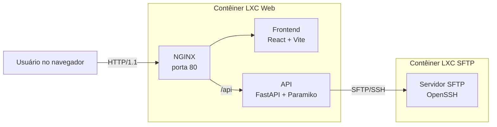

# SFTP Explorer

Interface web para conexão, navegação e gerenciamento de arquivos em servidores SFTP.

O projeto é desenvolvido para a disciplina de **Computação em Nuvem** do curso de **Engenharia de Computação do CEFET-MG - Campus Leopoldina**. Seu objetivo é disponibilizar uma interface amigável no navegador para acessar um servidor SFTP executado em uma infraestrutura virtualizada com Proxmox.

## Objetivo

O SFTP Explorer permite que o usuário informe o host, a porta, o nome de usuário e a senha de uma conta SFTP. Após a autenticação, a aplicação abre o diretório padrão dessa conta e oferece operações de gerenciamento de arquivos sem exigir o uso de um cliente SFTP de linha de comando.

O projeto também demonstra, de forma prática, a comunicação entre serviços executados em contêineres LXC distintos, o uso do NGINX como servidor web e proxy reverso e a integração entre uma aplicação HTTP e um serviço SFTP/SSH.

## Arquitetura planejada



A infraestrutura final será formada por dois contêineres LXC no Proxmox:

1. **Contêiner SFTP:** Ubuntu Server com OpenSSH/SFTP e os arquivos remotos.
2. **Contêiner Web:** NGINX, frontend React e API FastAPI responsável pela comunicação com o servidor SFTP por meio do Paramiko.

O NGINX servirá os arquivos estáticos gerados pelo frontend e encaminhará as requisições da API para o FastAPI. O backend não ficará diretamente exposto à rede.

## Funcionalidades previstas

### Conexão

- Informar host ou endereço IP, porta, usuário e senha pela interface.
- Validar a conexão antes de abrir o gerenciador.
- Acessar inicialmente o diretório padrão da conta SFTP.
- Exibir o estado da conexão e informações do servidor.
- Encerrar a conexão manualmente.

### Gerenciamento de arquivos

- Navegar entre diretórios por meio de pastas e breadcrumbs.
- Listar nome, tipo, tamanho, data de modificação e permissões dos itens.
- Pesquisar arquivos no diretório atual.
- Filtrar arquivos por categoria, como documentos, imagens, vídeos, áudios e compactados.
- Enviar arquivos ao servidor.
- Baixar arquivos.
- Criar diretórios.
- Renomear arquivos e diretórios.
- Excluir arquivos.
- Excluir diretórios vazios.

### Visão geral e atividade

- Exibir arquivos modificados recentemente.
- Calcular a quantidade e o tamanho dos arquivos acessíveis.
- Apresentar a distribuição dos arquivos por categoria.
- Registrar uploads e downloads realizados durante a sessão atual.

As categorias serão identificadas principalmente pela extensão dos arquivos. Os totais e a distribuição exigem uma leitura recursiva da árvore acessível e podem levar mais tempo em diretórios grandes. A atividade exibida representa somente as ações feitas pela aplicação durante a sessão, e não um histórico global do servidor SFTP.

## Ações disponíveis

| Item | Ações |
| --- | --- |
| Arquivo | Baixar, renomear e excluir |
| Diretório | Abrir, renomear e excluir quando estiver vazio |

Todas as operações respeitam as permissões Linux da conta autenticada. A interface não concede ao usuário permissões que ele não possua no servidor.

## Sessões e credenciais

- Cada navegador terá uma sessão independente no backend.
- Uma mesma conta SFTP poderá ser usada em conexões simultâneas.
- As credenciais serão mantidas somente na memória do backend e associadas a um identificador de sessão.
- A senha não será salva em banco de dados, arquivo, `localStorage` ou `sessionStorage`.
- A sessão será encerrada após **30 minutos de inatividade** ou quando o usuário clicar em **Desconectar**.
- Ao encerrar a sessão, a conexão SFTP será fechada e as credenciais serão removidas da memória.
- Não haverá bloqueio de arquivos. Operações simultâneas sobre o mesmo caminho poderão causar conflitos.

## Limitações de segurança

Esta versão utiliza **HTTP sem TLS** entre o navegador e o NGINX, conforme o escopo didático da disciplina. Embora a comunicação entre o backend e o servidor SFTP seja protegida por SSH, os dados enviados pelo navegador, incluindo a senha, não são criptografados pelo HTTP.

Por esse motivo:

- a aplicação deve permanecer restrita à rede interna do laboratório ou a outro ambiente controlado;
- não deve ser publicada diretamente na internet;
- devem ser utilizadas apenas contas criadas para o ambiente da disciplina;
- credenciais e dados pessoais não devem aparecer em logs ou mensagens de erro.

HTTPS, autenticação por chave e armazenamento compartilhado de sessões são melhorias previstas para uma possível evolução do projeto.

## Tecnologias

| Camada | Tecnologia |
| --- | --- |
| Virtualização | Proxmox VE e contêineres LXC |
| Servidor SFTP | Ubuntu Server e OpenSSH/SFTP |
| Frontend | React, TypeScript e Vite |
| Interface | CSS e Lucide React |
| Backend | Python, FastAPI e Paramiko |
| Servidor web | NGINX |
| Inicialização do backend | `systemd` |
| Protocolo web | HTTP/1.1 |
| Protocolo de arquivos | SFTP sobre SSH |

O projeto não utiliza banco de dados nem serviços de nuvem pública nesta etapa.

## Estado atual

| Etapa | Estado |
| --- | --- |
| Instalação do Proxmox no laboratório | Concluída |
| Criação do contêiner LXC com Ubuntu Server | Concluída |
| Configuração e teste do servidor SFTP | Concluídos |
| Máquina virtual Ubuntu Server/SFTP no VirtualBox para testes locais | Disponível |
| Protótipo visual do frontend React | Em desenvolvimento |
| Integração da interface com dados reais | Pendente |
| Criação do segundo contêiner LXC | Pendente |
| Implementação da API FastAPI/Paramiko | Pendente |
| Configuração do NGINX | Pendente |
| Criação do serviço `systemd` | Pendente |
| Implantação e testes integrados no laboratório | Pendente |

No estado atual, os dados exibidos pela interface são simulados. Os botões e indicadores visuais ainda não representam operações reais no servidor SFTP.

## Executando o frontend

Com Node.js e npm instalados:

```bash
npm install
npm run dev
```

O Vite exibirá no terminal o endereço local da aplicação.

Outros comandos disponíveis:

```bash
# Verificar o código com o linter
npm run lint

# Gerar a versão de produção
npm run build

# Visualizar localmente a versão gerada
npm run preview
```

## Estrutura atual

```text
.
|-- public/                  # Arquivos estáticos
|-- src/
|   |-- assets/             # Imagens e recursos visuais
|   |-- components/
|   |   |-- ConnectionModal.tsx
|   |   `-- FileManager.tsx
|   |-- App.tsx
|   |-- App.css
|   |-- index.css
|   |-- main.tsx
|   `-- mockData.ts         # Dados temporários da interface
|-- package.json
|-- vite.config.ts
`-- README.md
```

A estrutura será ampliada com o backend FastAPI e os arquivos de configuração necessários para NGINX e `systemd`.


## Contexto acadêmico

- **Instituição:** CEFET-MG - Campus Leopoldina
- **Curso:** Engenharia de Computação
- **Disciplina:** Computação em Nuvem
- **Professor:** Daniel Henriques
- **Autores:** Daniel Vasconcelos e Viktor Reckziegel
